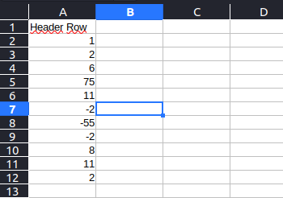
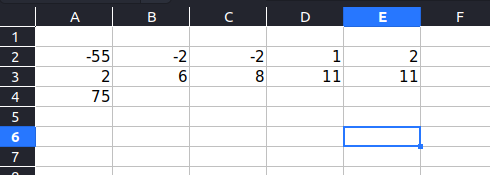

# CreateRol

Essa automação visa ordenar dados de uma planilha excel para outra planilha. Atualmente a aplicação ordena toda uma coluna de forma crescente e adiciona em uma planilha 5x5 com o nome que o usuário selecionar.

## Exemplos da automação





## Instalando e como usar

Clonando o repositório para sua máquina:
```
git clone https://github.com/RayKST/ROLCreate.git
```

Dentro da pasta clonada use o pip para instalar as dependẽncias da aplicação:
```
pip install -r requirements.txt
```

Para o funcionamento é necessário que você tenha uma planilha excel **input.xlsx** na pasta input. Siga o exemplo da imagem de input, crie uma coluna com os dados desejados que tenha no seu topo um nome como "Header" ou "Dados".

Para executar:
```
python main.py
```
O primeiro prompt após executar será o nome do topo do arquivo de entrada de dados, certifique-se de digitar corretamente o nome do header.
Depois basta selecionar o nome do arquivo que será gerado e pronto, você vai ter um novo arquivo ordenado no formato de uma tabela 5X5 na pasta output.